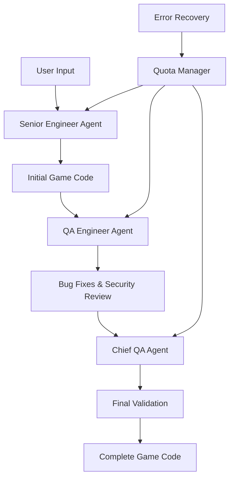

# 🎮 AI Game Builder - Multi-Agent Game Development System

[](https://python.org)
[](https://github.com/joaomdmoura/crewAI)
[](https://ai.google.dev/)
[](LICENSE)

> An intelligent multi-agent system that automatically creates complete Python games using AI. Built with CrewAI and powered by Google's Gemini AI, featuring advanced quota management and automatic error recovery.

Created by **naakaarafr** | *Transforming game ideas into playable code with AI*

---

## 🌟 Features

### 🤖 Multi-Agent Architecture
- **Senior Engineer Agent**: Creates initial game code with best practices
- **QA Engineer Agent**: Reviews and fixes bugs, security issues, and logic errors  
- **Chief QA Agent**: Final validation and production-ready optimization

### 🚀 Advanced AI Capabilities
- **Intelligent Quota Management**: Automatic detection and recovery from API rate limits
- **Exponential Backoff**: Smart retry mechanisms with increasing wait times
- **Adaptive Delays**: Dynamic request spacing based on error patterns
- **Resilient LLM Wrapper**: Custom Google Gemini integration with fault tolerance

### 🎯 Game Creation Features
- **Interactive Prompts**: User-friendly interface for game specification
- **Pre-built Examples**: Ready-to-use templates (Snake, Pong, Pacman)
- **Code Validation**: Automatic syntax checking and security scanning
- **File Export**: Direct save to `.py` files for immediate execution

### 📊 Monitoring & Recovery
- **Real-time Progress Tracking**: Visual progress indicators during creation
- **Comprehensive Logging**: Detailed logs saved to `game_builder.log`
- **Error Recovery**: Automatic handling of network, quota, and API issues
- **Training Mode**: Crew training with iteration tracking and success metrics

---

## 🚀 Quick Start

### Prerequisites
- Python 3.7 or higher
- Google Cloud Platform account with Gemini AI API access
- Internet connection for AI model requests

### Installation

1. **Clone the Repository**
   ```bash
   git clone https://github.com/naakaarafr/ai-game-builder.git
   cd ai-game-builder
   ```

2. **Install Dependencies**
   ```bash
   pip install -r requirements.txt
   ```

3. **Set Up Environment Variables**
   Create a `.env` file in the project root:
   ```env
   GOOGLE_API_KEY=your_google_gemini_api_key_here
   GEMINI_MODEL=gemini-2.0-flash
   GEMINI_TEMPERATURE=0.7
   GEMINI_MAX_TOKENS=2048
   REQUEST_DELAY=3.0
   MAX_RETRIES=5
   ```

4. **Get Your Google API Key**
   - Visit [Google AI Studio](https://makersuite.google.com/app/apikey)
   - Create a new API key
   - Add it to your `.env` file

### First Run

```bash
python main.py
```

Follow the interactive prompts to create your first AI-generated game!

---

## 🎯 Usage Examples

### Interactive Game Creation
```bash
python main.py
```
- Choose from pre-built examples or create custom games
- Automatic quota management handles API limitations
- Generated code is immediately playable

### Training the AI Crew
```bash
python main.py train 10 training_results.json
```
- Trains the multi-agent system over multiple iterations
- Saves success metrics and performance data
- Useful for optimizing agent performance

### Quota Monitoring
```bash
python main.py monitor
```
- Displays current configuration and quota settings
- Helps understand rate limiting parameters

---

## 🏗️ Architecture

### Project Structure
```
ai-game-builder/
├── main.py              # Entry point and CLI interface
├── crew.py              # CrewAI orchestration with quota handling
├── agents.py            # AI agent definitions and resilient LLM wrapper
├── tasks.py             # Task definitions for each agent
├── tools.py             # Code validation and security scanning tools
├── config.py            # Configuration management and rate limiting
├── .env                 # Environment variables (create this)
├── requirements.txt     # Python dependencies
├── game_builder.log     # Automatic logging output
└── README.md           # This file
```

### Multi-Agent Workflow



### Rate Limiting System
- **Request Delays**: 3+ seconds between API calls
- **Quota Detection**: Automatic recognition of rate limit errors
- **Exponential Backoff**: 60s, 90s, 120s+ wait times
- **Progress Visualization**: Real-time countdown during waits
- **Fallback Mechanisms**: Alternative configurations when primary fails

---

## 🎮 Supported Game Types

The system can create various types of Python games:

### 🕹️ Arcade Games
- **Snake**: Growing snake with food collection
- **Pong**: Classic paddle and ball game
- **Pacman**: Maze navigation with dot collection
- **Space Invaders**: Shooter with enemies and power-ups

### 🧩 Puzzle Games
- **Tetris**: Falling block puzzles
- **Memory Match**: Card matching games
- **Maze Games**: Pathfinding and collection

### 🏃 Action Games
- **Platformers**: Jumping and obstacle avoidance
- **Racing**: Top-down racing games
- **Tower Defense**: Wave-based strategy

### Custom Games
Describe any game concept and the AI will attempt to create it!

---

## 🔧 Configuration

### Environment Variables

| Variable | Default | Description |
|----------|---------|-------------|
| `GOOGLE_API_KEY` | *Required* | Your Google Gemini API key |
| `GEMINI_MODEL` | `gemini-2.0-flash` | AI model to use |
| `GEMINI_TEMPERATURE` | `0.7` | Creativity level (0.0-1.0) |
| `GEMINI_MAX_TOKENS` | `2048` | Maximum response length |
| `REQUEST_DELAY` | `3.0` | Seconds between API calls |
| `MAX_RETRIES` | `5` | Maximum retry attempts |

### Rate Limiting Configuration

The system automatically manages Google Gemini API quotas:

- **Free Tier**: 15 requests per minute
- **Paid Tier**: Higher limits based on your plan
- **Automatic Detection**: Recognizes quota exceeded errors
- **Smart Recovery**: Waits for quota restoration
- **Visual Progress**: Shows countdown during waits

---

## 🛠️ Advanced Features

### Custom Agent Configuration

Modify `agents.py` to customize AI behavior:

```python
# Example: Adjust agent parameters
senior_engineer = Agent(
    role="Senior Software Engineer",
    goal="Create high-quality, functional game code efficiently",
    max_iter=5,  # Increase for more thorough processing
    temperature=0.7,  # Adjust creativity
    memory=True,  # Enable agent memory
)
```

### Security Scanning

Built-in security tools scan for:
- Dangerous function usage (`eval`, `exec`)
- Shell command execution
- Unsafe file operations
- Import statement validation

### Code Validation

Automatic validation includes:
- Syntax error detection
- Import verification
- Logic flow analysis
- Bracket matching

---

## 🐛 Troubleshooting

### Common Issues

#### API Key Problems
```
❌ GOOGLE_API_KEY not found in environment variables
```
**Solution**: Create `.env` file with your API key

#### Quota Exceeded
```
⚠️ QUOTA LIMITATION DETECTED
```
**Solutions**:
- Wait 1-2 hours for quota reset
- Upgrade your Google Cloud billing plan
- Use a different API key
- Try creating simpler games

#### Network Issues
```
❌ Network connectivity issue detected
```
**Solutions**:
- Check internet connection
- Verify Google AI services accessibility
- Try again in a few minutes

#### Import Errors
```
ModuleNotFoundError: No module named 'pygame'
```
**Solution**: Install required packages
```bash
pip install pygame
```

### Performance Optimization

For faster game creation:
1. Use simpler game prompts
2. Choose "Snake" from examples (shortest code)
3. Ensure stable internet connection
4. Use paid Google Cloud tier for higher quotas

---

## 📈 Monitoring & Logging

### Log Files
- **Location**: `game_builder.log`
- **Contents**: API calls, quota status, errors, timing
- **Format**: Timestamped entries with severity levels

### Success Metrics
Track system performance:
- API call success rate
- Average generation time
- Quota utilization
- Error recovery effectiveness

### Training Analytics
When using training mode:
```json
{
  "total_iterations": 10,
  "successful_runs": 8,
  "success_rate": 80.0,
  "results": [...]
}
```

---

## 🤝 Contributing

We welcome contributions! Here's how to get started:

### Development Setup
1. Fork the repository
2. Create a feature branch: `git checkout -b feature-name`
3. Make your changes
4. Add tests if applicable
5. Submit a pull request

### Contribution Guidelines
- Follow Python PEP 8 style guidelines
- Add docstrings to new functions
- Update README for significant changes
- Test with multiple game types
- Ensure quota handling still works

### Areas for Improvement
- [ ] Support for other AI models (OpenAI, Claude)
- [ ] GUI interface for game creation
- [ ] More sophisticated code optimization
- [ ] Additional game templates
- [ ] Performance benchmarking tools

---

## 📄 License

This project is licensed under the MIT License - see the [LICENSE](LICENSE) file for details.

---

## 🙏 Acknowledgments

- **CrewAI**: For the multi-agent framework
- **Google Gemini**: For the powerful AI capabilities
- **Pygame Community**: For the game development library
- **Python Community**: For the excellent ecosystem

---

## 📞 Support

Having issues? Here's how to get help:

1. **Check the logs**: Look at `game_builder.log` for detailed error information
2. **Review this README**: Most common issues are covered in troubleshooting
3. **Google Cloud Console**: Check your API quotas and billing
4. **Create an Issue**: Use GitHub issues for bug reports or feature requests

---

## 🔮 Future Roadmap

### Version 2.0 (Planned)
- [ ] Web interface for easier game creation
- [ ] Support for Unity and other game engines
- [ ] Multiplayer game templates
- [ ] Advanced graphics and sound integration

### Version 2.1 (Planned)
- [ ] Game asset generation (sprites, sounds)
- [ ] Automated game testing and QA
- [ ] Publishing pipeline to itch.io/Steam
- [ ] Collaborative game development features

---

**Created with ❤️ by naakaarafr**

*Turn your game ideas into reality with the power of AI!*
